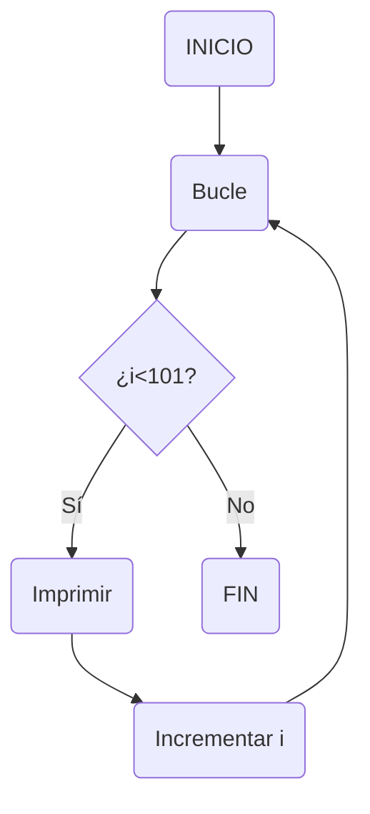
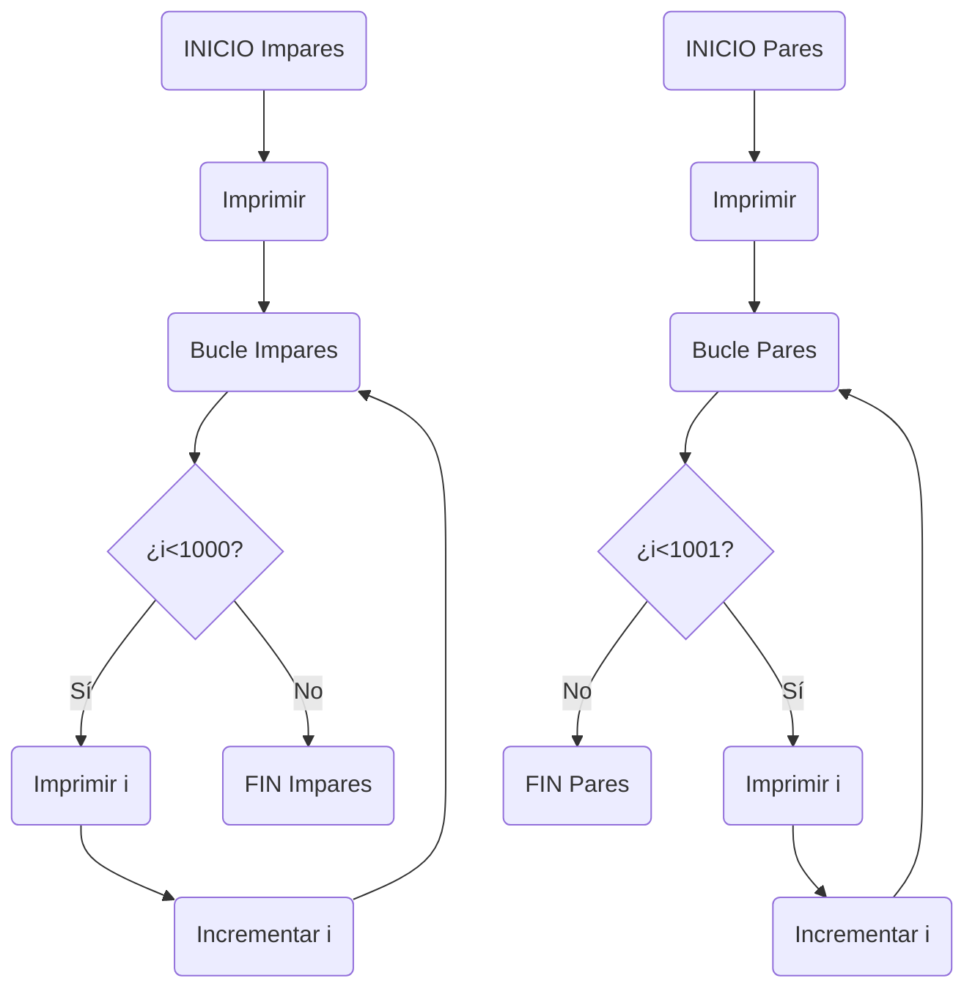
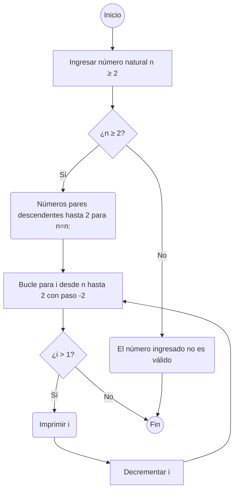

# Reto---7
<br>
Desarrolle de manera individual la mayoría de ejercicios en clase. Para cada punto cree un programa individual asimismo cree un notebook con la solución a todos los problemas. Al finalizar suba todo a un repo y subalo al canal reto_7 en slack, los tres primeros puntos deben incluir diagrama de flujo.
<br>

### Nota: Todo el código de aquí en adelante debe ir debidamente documentado.
<br>

### 1.Imprimir un listado con los números del 1 al 100 cada uno con su respectivo cuadrado.

<br>

```
for i in range(1, 101):
    print(f"{i} al cuadrado es {i**2}")
```
<br>
El código que proporcioné utiliza un bucle para recorrer los números del 1 al 100. En cada paso del bucle, imprime el número actual junto con su cuadrado. Por ejemplo, para el número 1, imprimirá "1 al cuadrado es 1", para el número 2 imprimirá "2 al cuadrado es 4", y así sucesivamente hasta llegar al número 100. Esto se logra mediante el uso de la función print() y el operador ** para calcular el cuadrado.

<br>

### Diagrama de flujo



<br>

### 2.Imprimir un listado con los números impares desde 1 hasta 999 y seguidamente otro listado con los números pares desde 2 hasta 1000.

<br>

```
print("Números impares:")
for i in range(1, 1000, 2):
    print(i)


print("Números pares:")
for i in range(2, 1001, 2):
    print(i)
```

Este código utiliza dos bucles para imprimir dos secuencias de números:

El primer bucle imprime números impares del 1 al 999.
El segundo bucle imprime números pares del 2 al 1000.
Cada bucle itera sobre los números en un rango específico y los imprime . Para los impares, empezamos en 1 y sumamos 2 en cada paso. Para los pares, empezamos en 2 y también sumamos 2 en cada paso. De esta manera, obtenemos las dos secuencias deseadas.

<br>

### Diagrama de flujo


<br>

### 3.Imprimir los números pares en forma descendente hasta 2 que son menores o iguales a un número natural n ≥ 2 dado

<br>

```
n = int(input("Ingrese un número natural mayor o igual a 2: "))

if n >= 2:
    print(f"Números pares descendentes hasta 2 para n={n}:")
    for i in range(n, 1, -2):
        print(i)
else:
    print("El número ingresado no es válido. Por favor, ingrese un número natural mayor o igual a 2.")
```
<br>

 el código funciona solicitando al usuario que ingrese un número natural, verificando si este número es válido y luego imprimiendo los números pares descendentes correspondientes según la entrada del usuario. Si la entrada no es válida, se muestra un mensaje de error.

<br>

### Diagrama de flujo




<br>

### 4.En 2022 el país A tendrá una población de 25 millones de habitantes y el país B de 18.9 millones. Las tasas de crecimiento anual de la población serán de 2% y 3% respectivamente. Desarrollar un algoritmo para informar en que año la población del país B superará a la de A.

<br>

```
poblacion_a = 25  
poblacion_b = 18.9 
tasa_crecimiento_a = 0.02 
tasa_crecimiento_b = 0.03 
año = 2022  

# Mientras la población de B sea menor o igual a la de A, continuar incrementando las poblaciones
while poblacion_b <= poblacion_a:
    # Incrementar las poblaciones de ambos países según sus tasas de crecimiento anuales
    poblacion_a *= (1 + tasa_crecimiento_a)
    poblacion_b *= (1 + tasa_crecimiento_b)
    # Incrementar el año en 1
    año += 1

# Una vez que la población de B supere a la de A, imprimir el año en que sucede
print(f"La población del país B superará a la del país A en el año {año}.")
```

<br>

- Inicialización de variables: Se definen las poblaciones iniciales de los países A y B, así como las tasas de crecimiento anuales y el año inicial.

- Bucle while: Se ejecuta un bucle mientras la población del país B sea menor o igual a la del país A.

- Incremento de poblaciones: En cada iteración del bucle, se aumenta la población de ambos países para el próximo año según sus tasas de crecimiento.

- Actualización del año: Se incrementa el año en 1 después de cada iteración del bucle.

- Impresión del resultado: Una vez que la población del país B supera a la del país A, se imprime el año en que esto sucede.

- En resumen, el código calcula en qué año la población del país B superará a la del país A mediante un proceso de crecimiento anual de población.

<br>

### 5.Imprimir el factorial de un número natural n dado.

<br>

```
n = int(input("Ingrese un número natural: "))


if n < 0:
    print("El factorial no está definido para números negativos.")
elif n == 0:
    print("El factorial de 0 es 1.")
else:
    factorial = 1
    for i in range(1, n + 1):
        factorial *= i
    print(f"El factorial de {n} es {factorial}.")
```
<br>

Este código solicita al usuario que ingrese un número natural. Luego, verifica si el número ingresado es negativo, en cuyo caso muestra un mensaje de error. Si el número es 0, imprime que el factorial de 0 es 1. Si el número es positivo, calcula el factorial utilizando un bucle for y lo imprime.

<br>

### 6.Implementar un algoritmo que permita adivinar un número dado de 1 a 100, preguntando en cada caso si el número es mayor, menor o igual.

<br>

```
def adivinar_numero():
    
    limite_inferior = 1
    limite_superior = 100

    while True:
        # Adivinar el número medio
        intento = (limite_inferior + limite_superior) // 2
        respuesta = input(f"¿Es {intento} el número que has pensado? (mayor/menor/igual): ")

        # Verificar 
        if respuesta.lower() == 'igual':
            print(f"¡Excelente! He adivinado tu número: {intento}.")
            break
        elif respuesta.lower() == 'mayor':
            limite_inferior = intento + 1
        elif respuesta.lower() == 'menor':
            limite_superior = intento - 1
        else:
            print("Respuesta no válida. Por favor, responde 'mayor', 'menor' o 'igual'.")

# Llamar a la función para iniciar el juego
adivinar_numero()

```
<br>

-  Inicialización de límites: Comenzamos con el rango de números entre 1 y 100.

- Adivinar el número medio: Calculamos el número medio del rango y preguntamos al usuario si el número que pensó es mayor, menor o igual.

- Ajuste de límites: Basándonos en la respuesta del usuario, ajustamos los límites del rango para enfocarnos en la mitad correcta del rango.

- Repetición: Repetimos este proceso hasta adivinar correctamente el número.

- Mensaje de éxito: Cuando adivinamos correctamente el número, mostramos un mensaje de éxito.

En resumen, el código divide repetidamente el rango de números a la mitad basándose en las respuestas del usuario, hasta que adivinamos correctamente el número pensado por el usuario.

<br>

### 7.Implementar un programa que ingrese un número de 2 a 50 y muestre sus divisores.

<br>

```
numero = int(input("Ingrese un número entre 2 y 50: "))

if 2 <= numero <= 50:
    print(f"Los divisores de {numero} son:")
    for i in range(1, numero + 1):
        if numero % i == 0:
            print(i)
else:
    print("El número ingresado está fuera del rango permitido.")
```
<br>

- Entrada del usuario: Solicitamos al usuario que ingrese un número entre 2 y 50.

- Verificación del rango: Comprobamos si el número ingresado está dentro del rango permitido.

- Bucle de divisores: Iteramos desde 1 hasta el número ingresado e imprimimos los números que dividen de manera exacta al número dado.

- Mensaje de error: Si el número está fuera del rango permitido, mostramos un mensaje de error.

En resumen, el programa encuentra y muestra todos los divisores de un número dado, siempre y cuando el número esté dentro del rango permitido. Si no lo está, se muestra un mensaje de error.

<br>

### 8.Implementar el algoritmo que muestre los números primos del 1 al 100. Nota: use funciones

<br>


 


